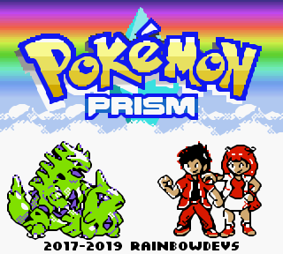
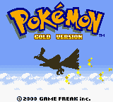
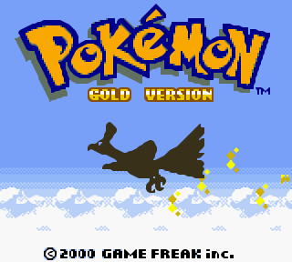

# hq2xgo

 [](https://godoc.org/github.com/pokemium/hq2xgo)

Enlarge image by 2x with hq2x algorithm

## Example(Before -> After)

&nbsp;&nbsp;&nbsp;&nbsp;

<br />

&nbsp;&nbsp;&nbsp;&nbsp;

## Usage

### command line

```sh
$ make build # require make and go
$ hq2x input.png output.png
```

### golang package

See [godoc](https://godoc.org/github.com/Akatsuki-py/hq2xgo) for details. 

```sh
$ go get github.com/pokemium/hq2xgo
```

```go

import (
	hq2x "github.com/pokemium/hq2xgo"
)

after, err := hq2x.HQ2x(before) // var before *image.RGBA

```